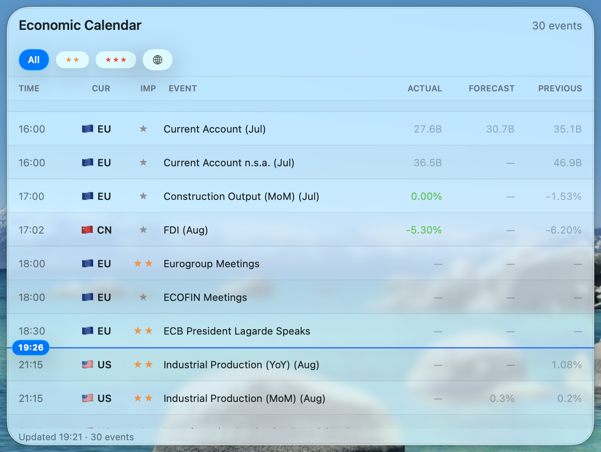
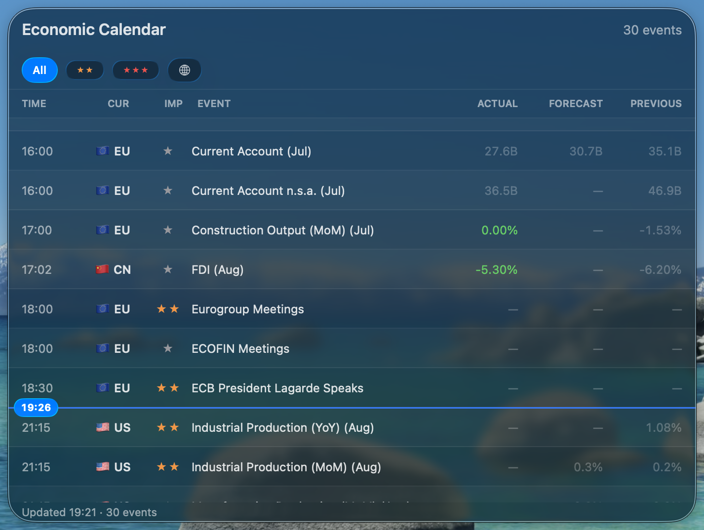
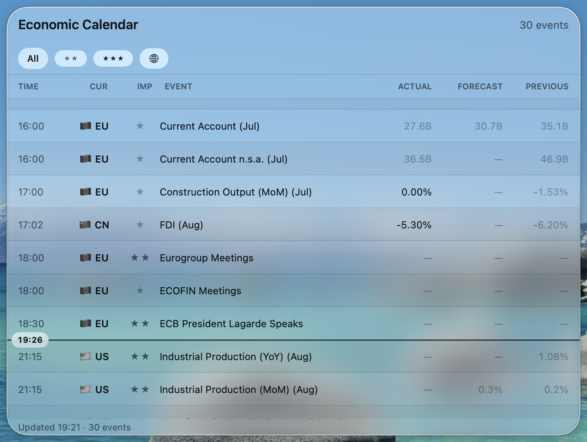

# Economic Calendar

一款 macOS 桌面经济日历小组件 —— 以 Liquid Glass 浮层卡片常驻桌面，自动抓取 investing.com 日历数据，按重要性 / 国家筛选，重要事件开始前推送系统通知。原生 Swift（SwiftUI）实现，点击不抢当前应用的键盘焦点。


| | 浅色 | 深色 |
|---|---|---|
| **聚焦 / 桌面聚焦**（可读态） |  |  |
| **其他窗口聚焦**（透明态） |  |  |

↑ 实拍：对齐原生桌面 widget 的两种状态 —— 聚焦时为可读的 Liquid Glass 毛玻璃；其他窗口聚焦时淡化为透明磨砂，**文字与图标切换为单色亮度阶梯**（颜色语义改用亮度表达：★ 重要性三级灰阶、涨跌用明暗区分），并随外观叠一层中性补偿：深色压暗成暗玻璃 widget、浅色提亮成亮玻璃 widget（深色白字、浅色深字，任何壁纸上都保持对比度）。卡片边缘带凝光高亮。当前时间分割线（胶囊）插在两行分界处并逐分钟刷新，材质实时透出并跟随桌面壁纸。

## 为什么是它

- **像小组件一样用**：无 Dock 图标、不抢焦点的浮层卡片，常驻桌面一角，每 10 分钟自动更新
- **一眼看到"现在"**：当前时间分割线嵌在两行分界处（investing.com 同款），启动自动定位，浏览后 5 分钟无操作自动回位
- **只看关心的事件**：重要性（All / ★★+ / ★★★）与国家（货币）一键筛选；高重要性事件开始前 15 分钟系统通知

## 快速开始（Quickstart）

要求：Apple Silicon Mac，macOS 26+，[Xcode 26+](https://apps.apple.com/app/xcode/id497799835)。

```bash
git clone git@github.com:BoyceFong/economic-calendar.git
cd economic-calendar
swift/Scripts/build.sh --install
```

脚本会构建、签名、安装到 `/Applications` 并自动启动。**预期结果**：桌面出现经济日历卡片，几秒内开始显示当日事件（首次使用通知功能会请求一次系统通知授权）。

常用变体：

```bash
swift/Scripts/build.sh           # 只构建，产物在 swift/dist/
swift/Scripts/build.sh --open    # 构建后直接打开，不安装
swift/Scripts/run.sh             # 开发模式裸跑（不打包）
```

下一步：了解[日常使用](#使用说明usage)或阅读[设计文档](docs/DESIGN.md)。

## 功能亮点（Features）

- **Liquid Glass 界面** —— macOS 26 原生玻璃材质，浅色 / 深色自动适配；开启「降低透明度」自动退化为不透明卡片
- **当前时间分割线** —— 零占位嵌在两行之间，胶囊显示当前 `HH:mm`，每分钟刷新；列表首尾边界完整显示
- **智能滚动** —— 启动 / 筛选时跳到当前时间；手动浏览时不被打断，5 分钟无操作自动回位
- **重要性 + 国家筛选** —— 玻璃按钮常驻（选择持久化），右键菜单同步提供
- **事件直达** —— 双击打开该事件的 investing.com 详情页；⌃点击复制事件数据；点通知直达事件页
- **提前通知** —— 高重要性事件开始前 15 分钟系统通知（去重状态持久化，重启不重发）
- **登录自启** —— 右键一键开关，写入系统登录项
- **数据兜底** —— 抓取失败自动沿用上次缓存；investing.com 改版自动落盘页面快照便于排查

## 使用说明（Usage）

### 界面与手势

| 操作 | 效果 |
|---|---|
| 拖动标题栏 | 移动窗口（仅标题栏可拖） |
| 拖动窗口边缘 | 调整大小（524×300 ~ 1200×1600，自动记住） |
| 单击筛选按钮 | 切换最低重要性（All / ★★+ / ★★★）或打开货币多选 |
| 双击事件行 | 浏览器打开该事件详情页 |
| ⌃ + 点击事件行 | 复制事件详情到剪贴板 |
| 右键（行 / 空白） | 完整菜单：复制、打开、筛选、立即刷新、置顶、登录自启、退出 |
| 滚轮 / 触控板 | 自由滚动；5 分钟无操作自动回到当前时间 |

### 通知

首次触发前系统会请求通知授权，允许后：高重要性（★★★）事件开始前 15 分钟推送，内容含预期值 / 前值，点击直达事件页。已推送的事件持久记录，重启不会重发。

### 配置

界面配置（窗口位置、置顶、筛选）开箱即用、自动持久化。进阶参数可用 `defaults` 覆盖：

```bash
defaults write com.economiccalendar.widget config.refreshIntervalMinutes -int 5   # 抓取间隔
defaults write com.economiccalendar.widget config.currencies -array USD EUR CNY   # 抓取的币种范围
defaults write com.economiccalendar.widget config.leadTimeMinutes -int 30         # 提前通知分钟数
```

完整参数见 [swift/README.md](swift/README.md#配置)。数据文件位置（cache / 通知去重 / 日志）：`~/Library/Application Support/EconomicCalendar/` 与 `~/Library/Logs/EconomicCalendar/`。

### 命令行工具

```bash
swift/Scripts/run.sh --print-cache   # 查看本地缓存的日历数据
swift/Scripts/run.sh --fetch-once    # 手动跑一次抓取（调试抓取问题）
swift/Scripts/run.sh --parse-test    # 解析逻辑自检（含与旧版的数据兼容断言）
```

## 项目结构

```
swift/                        # 全部应用代码（SwiftPM 包）
  Sources/EconomicCalendar/
    App/                      # 装配、窗口、中心模型、用户动作
    Core/                     # 事件模型、解析、存储、配置
    Fetching/                 # WKWebView 抓取管线 + 提取 JS
    Services/                 # 调度、通知、登录项
    UI/                       # SwiftUI 视图
  Scripts/build.sh            # 构建 / 安装 / 启动
  README.md                   # 开发者文档（构建细节、路径、配置项）
docs/DESIGN.md                # 架构与设计决策（必读）
docs/screenshot-*.png         # 界面截图
```

## 文档

- [设计文档](docs/DESIGN.md) —— 架构、抓取管线、时间分割线与自动滚动设计、事件 ID 兼容契约、并发模型
- [swift/README.md](swift/README.md) —— 构建系统细节、数据文件路径、全部配置项

## 边界与 FAQ（Limitations & FAQ）

- **Windows / Linux？** 不支持，这是纯原生 macOS 应用（需要 macOS 26 的 Liquid Glass API）。
- **为什么不是桌面 Widget（WidgetKit）？** WidgetKit 不支持自由滚动，无法浏览完整日历列表；详见[设计文档 §1](docs/DESIGN.md#1-背景与目标)。
- **抓不到数据了？** investing.com 改版所致。看 `~/Library/Application Support/EconomicCalendar/debug_page.html`（自动落盘的页面快照）对照修复 `swift/Sources/EconomicCalendar/Resources/ExtractCalendar.js`，期间应用继续显示上次缓存。
- **首次安装提示"无法验证开发者"？** 应用为 ad-hoc 签名，`--install` 脚本已自动执行 `xattr -cr`；手动拷贝 .app 的话执行一次 `xattr -cr /Applications/EconomicCalendar.app`。
- **时区？** 全部时间以 Asia/Shanghai 显示（与旧版一致），不随出行地变化。
- **从旧 Python 版升级？** 数据文件格式与事件 ID 完全兼容，缓存与通知去重状态无缝衔接；首次启动会自动只读迁移旧 `config.yaml`。

## 贡献（Contributing）

Issue 与 PR 均欢迎。改解析 / 抓取逻辑请附带 `--parse-test` 与 `--fetch-once` 的验证结果；改 UI 请附浅色 + 深色两张截图。

## 许可证（License）

个人项目，暂未附带开源许可证（默认保留所有权利）。如需引用代码请先开 issue 沟通。
